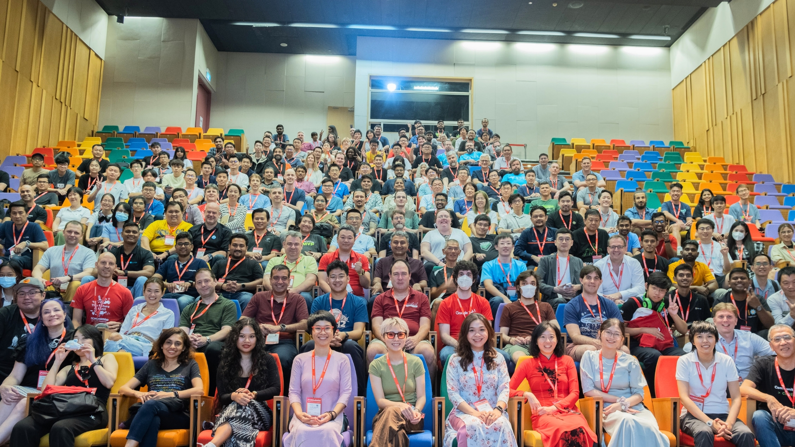

# FOSSASIA Summit 2023

On the 13th, 14th, and 15th of April 2023, [Hack Club](https://hackclub.com/) has been invited to run a community booth at the FOSSASIA summit, an in-person and online event in Singapore at the Lifelong Learning Institute. It was an amazing opportunity to showcase our projects and ideas at Asia's largest open-source conferences.

We quickly got to work before the conference, organizing volunteers to man the booth and brainstorming ideas to make the most of the event. A challenge was set up for FOSSASIA participants to draw their versions of Orpheus, which resulted in some… [creative dinos being drawn.](photos/challenge)

Overall, the summit was a remarkable experience for all of us, and we look forward to continuing our efforts to promote our open-source projects and mission in events like this.

– Peter aka [@cytronicoder](https://github.com/cytronicoder)

## Event rundown

| Day        | Event                                                              |
|:-----------|:-------------------------------------------------------------------|
| 12th April | Hack Club booth setup in the afternoon                             |
| 13th April | Hack Club booth opens                                              |
| 14th April | Hack Club booth continues, and we did some programming shenanigans |
| 15th April | Sam gave a talk on Hack Club Bank and open-source banking          |

## Photos

You can find all the Hack Club photos from the event [here.](photos) For more photos, check out the [FOSSASIA Summit 2023](https://photos.app.goo.gl/itFjzW9XvPFyx7Yh7) album on Google Photos.

## Learn more

Interested in reading about how we ran the booth and the various shenanigans we got up to along the way? Check out the rest of the repository!

| Further reading                                         | Description                                                              |
|:--------------------------------------------------------|:-------------------------------------------------------------------------|
| [`setup`](setup.md)                                     | How we set up the booth                                                  |
| [`running-the-booth`](running-the-booth.md)             | How we ran the booth, from the Orpheus challenge to sticker distribution |
| [`assorted-shenanigans`](assorted-shenanigans.md) | Hmm... I wonder what this is about...                                    |
| [`sam-talk`](sam-talk.md)                               | Sam's talk on Hack Club Bank and open-source banking                     |

## Credits

Many thanks to [@sampoder](https://github.com/sampoder) and [@provsalt](https://github.com/provsalt) for helping to run the booth!
