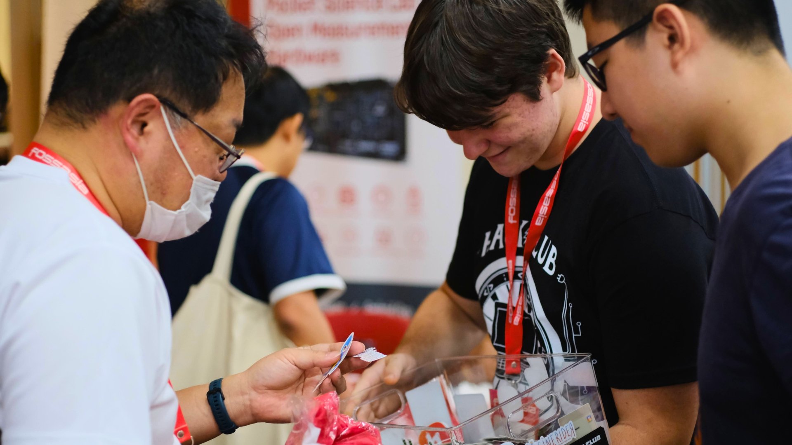

# Assorted shenanigans

We had a lot of fun at the summit, and we got up to a lot of shenanigans. Here's a list of some of the things we did:

## Trolling `place.hackclub.com` with... WHAT?

Some of us here got bored and went to a Starbucks, where we sat and masterfully constructed [the one and only John Cena.](https://cloud-efpbdnesi-hack-club-bot.vercel.app/0dcccf688-3055-41f5-8dbc-9f7757f034d9-img_5620.jpg) Then, we returned to the place and updated the board with [a photo from a certain hackathon!](https://cloud-llu9hja5k-hack-club-bot.vercel.app/0ab255b7d-80e0-42c1-a5fc-94446be32d78-img_5625.png)

## Dinobox laser cut

I worked with LionsForge to laser-cut [a Dinobox acrylic piece!](https://cloud-ixijale3c-hack-club-bot.vercel.app/0ca9e331c-a851-4f02-b249-26a4a731b457-img_5624.jpg) I will be going to buy an LED base to put this on.

## Stickers run

We had a lot of stickers, and we wanted to give them out to people. So, we went on a stickers run, where we went around the summit and gave out stickers to people. Surprisingly, we gave out almost a quarter of the box in just one run!

## Karaoke at the Thursday party

FOSSASIA had a party on Thursday night for all of the booth organisers and speakers, and we had [a lot of fun](https://cloud-qyrn734sz-hack-club-bot.vercel.app/0image.png) singing karaoke and dancing. I also got to learn about [Mixxx](https://mixxx.org/), an open-source DJ software that I'm going to try out soon!
