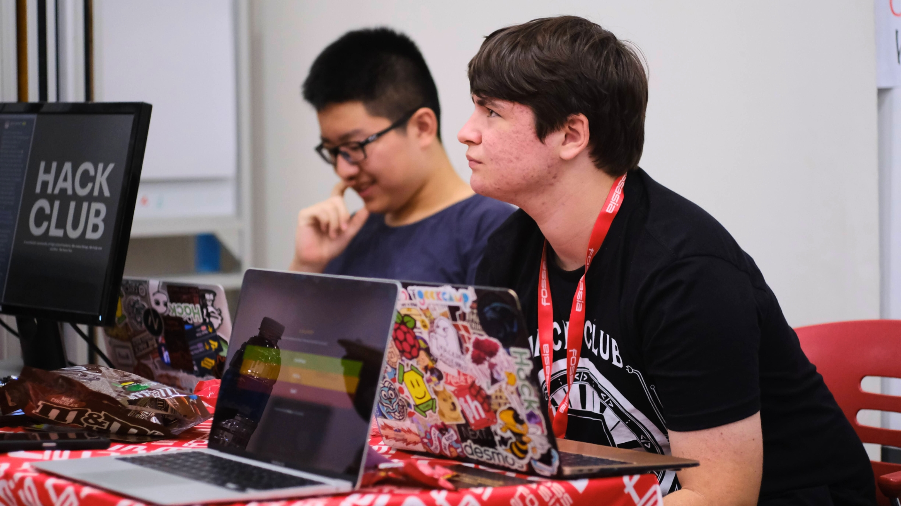

# Running the booth

Running the booth was a lot of fun! We had a lot of people come by and ask us questions about Hack Club, especially about our projects and how we run our community on Slack. It was great introducing people to the various projects we current have in development (like [Sinerider](https://sinerider.com) and [Hack Club Bank](https://hackclub.com/bank/)) and how students can get involved in the community.

The drawing challenge also received a lot of attention, with people coming by to draw their own versions of Orpheus. You can see some of the entries [here.](photos/challenge)

## What we did well

- Many people were interested in Hack Club and what we do, and we were able to answer their questions and introduce them to our projects.
- There was a lot of interest in how we built our transparent Bank and how we manage everything online. Additionally, some were interested in the Sprig hardware we had on display.
- People had a lot of fun drawing their own versions of Orpheus, and we were able to give them a Vercel beanie with some stickers inside as a prize.

## What we could have done better

- We should have been a bit proactive in manning the booth. We had some people come by the booth, but we were either out exploring the rest of the summit or eating lunch. We should have had a schedule of who was manning the booth at what time.

Overall, however, I think we did a great job running the booth and introducing people to Hack Club and our projects. Especially considering that we were a small team of 3 people, I'm really proud of what we were able to accomplish at the summit.
