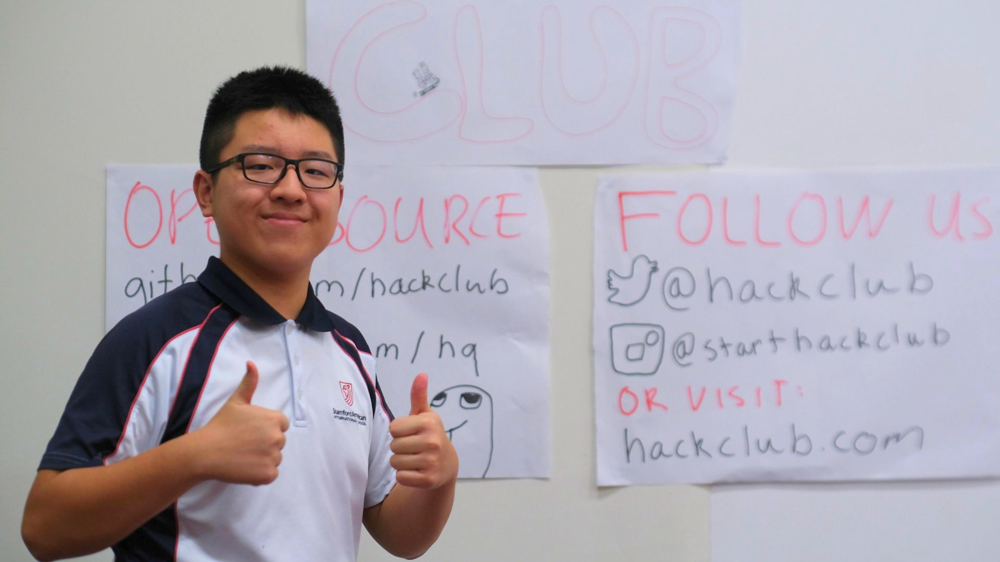

# Setting up everything

On Wednesday afternoon, we arrived at the site to set up our booth. Sam arrived three hours earlier than the rest of us. We had a list of items that we wanted to have at the booth, but unfortunately, we did not have all of them. Here is a list of the items we had and the ones we were missing:

Items we had:

- [X] A laptop with the Sprig Editor connected to a Sprig console
  - [X] One additional floating Sprig console, thanks to the people at the booth next to us (BuildingBloCS!) who built the other one.
- [X] A monitor connected to a Raspberry Pi running the `assemble-tv-thing` combined with Scrapbook (`tv-thing`)
- [X] A laptop running SineRider
- [X] A plastic box containing stickers
- [X] Modified copies of the FIRST and hackathons postcards
- [X] A printed copy of the annual report with a binder

Items we were missing:

- [ ] A small monitor connected to a laptop using extended display to loop the Epoch & Assemble videos
- [ ] A laptop connected to a Drawing Thing
- [ ] A custom flag on a flag stand

We also found a few flip charts and markers next to our booth, so we drew up posters to put up on the walls behind the booth, which can be seen in the photo above. We also started the "Draw the Orpheus challenge" where we asked people to draw Orpheus, and in return, we gave them a Vercel beanie with some stickers inside as a small prize.
